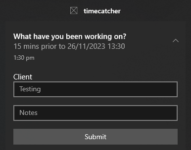
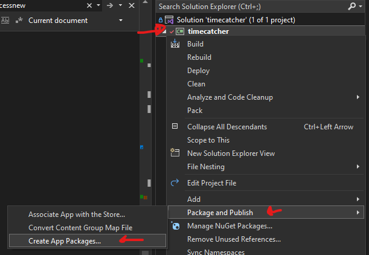
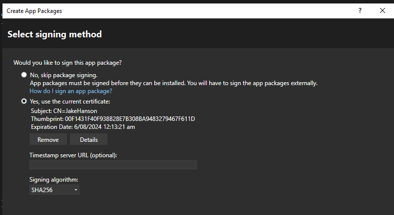
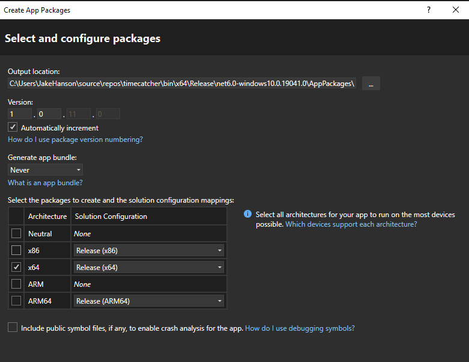
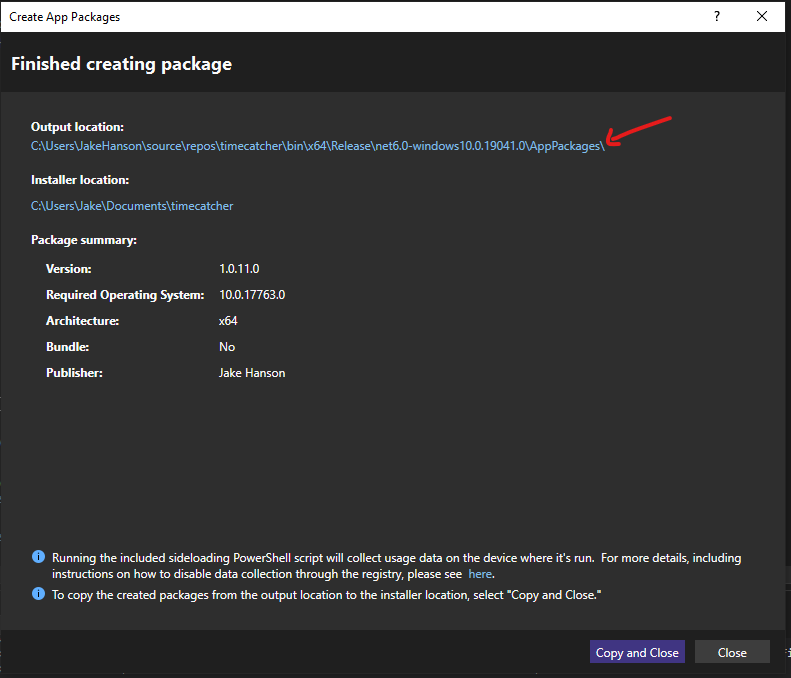
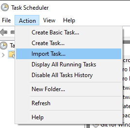
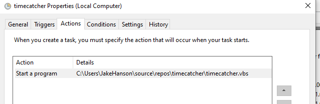

# timecatcher

This is a small app which will pop up every 15 minutes (configurable) with an App Notification asking you to submit what you're working on.

It will store the outputs in a csv file which you can then pivot to create a timesheet based on your time entries from the week.

At this time, you have to package it yourself as I've not had it published to the Microsoft Store, so you need to create and 
install your own certificate.

## Installation

### Packaging

- Install Visual Studio 2022
- Download or clone this repo
- Open the csproj file in the repo
- In the solution explorer, right click on Timecatcher, and go to Package and Publish > Create App Package

- Choose Sideloading on the next page
- On the next page, create a new certificate if one is not already created

- Next, choose your builds. You only need x64: Release

- Finally, hit Create.

- On the results page, copy the Output location, and navigate to it for the next step: installation

### Installing

Navigate to the packaged .msix in the folder below, and double click it to install.

	.\repos\timecatcher\bin\x64\Release\net6.0-windows10.0.19041.0\AppPackages\

### Scheduling

In task scheduler, go to Action > Import and select the timecatcher_scheduledtask.xml file.

Under Actions, modify the location to point to the timecatcher.vbs file in the repo

You can modify the interval that the popup will show (to 30 minutes, for example) using the Triggers in Task Scheduler.
However, by default, the app will suppress any task inititions that aren't a multiple of 15 minutes. To modify this,
you must also modify the Interval value in "My Documents/timecatcher/config.json". Changing it to a value of **1** will allow 
the app to be run every minute, if you wanted it to be...

## Usage

- Enter the Client in the top box
- Optionally enter Notes in the bottom box
- Click submit (or anywhere on the notification outside the text boxes) to submit and close the notification
- Clicking the X will close the notification and not submit

The Client value will be saved and also be used in the popup next time. If you are still working on the same client, click submit 
and it will store the same value as last time. 

If you have been inactive (no mouse movements) for 5 minutes when the popup appears, the value will be set to Inactive. 

Once the notification expires, it can be found in the notification bar for the next 14 minutes, after which it will expire and store
the previous value (or Inactive, if appropriate). It will also set the "Manual" field to False in the report so you know it was 
an automatic submission.

> Note: Don't press the enter key when submitting timecatches, it will screw up the csv and you'll have to fix it manually.

> Note: Don't have the csv open in Excel during the week or the timecatches won't save.

## Reports

- Each week (starting Monday) a new spreadsheet will be created in "My Documents/timecatcher"
- This will contain the following fields
    - Client
	- Notes
	- Timestamp (when the notification first popped up)
	- Manual (whether the submission was manual or automatic)
	- Interval (for quickly pivoting the timesheet

In Excel (or your preferred spreadsheet), create a Pivot Table (Same Window is best) by 
1. Selecting timestamp
1. Drag timestamp (Days) into the columns and remove Hours, Minutes by dragging them back up top.
1. Drag Client into Rows
1. Drag Interval into Values. Leave it as Sum.

You will see a nice summarised timesheet next to all your timecatches which you can then load into your timesheeting system.

